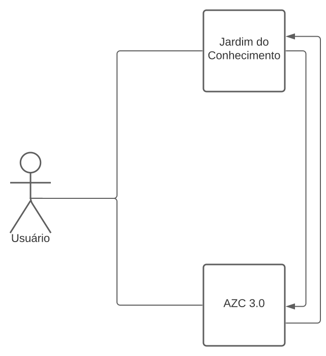

# Documento de Arquitetura

| Data | Versão | Descrição | Autor |
|--|--|--|--|
19/03/2021 | 0.5 | Tópicos 1,2,3 e 4 | Leonardo Takehana |

# 1 Introdução

## 1.1 Finalidade

 &emsp;&emsp;
Esse documento de arquitetura tem como função mostrar uma visão geral sobre a arquitetura utilizada pelo software Jardim do Conhecimento, ela é uma descrição do sistema que auxilia na compreensão de como o sistema irá se comportar. Portanto, especifica decisões relevantes na produção e implementação do projeto em relação a como acontecerá a comunicação dos diversos serviços contidos no software como um todo.

## 1.2 Escopo

&emsp;&emsp;
O Documento de Visão tem o objetivo de deixar explícito os problemas em que o projeto Yagdrasil se propõe a resolver e as soluções em que o mesmo se propõe a adotar para atingir seu objetivo. É importante ressaltar que este documento será evoluído ao decorrer do desenvolvimento do projeto.

## 1.3 Referências

* [Como documentar a Arquitetura de Software](http://www.linhadecodigo.com.br/artigo/3343/como-documentar-a-arquitetura-de-software.aspx)
* [Documento de Arquitetura Aix](https://fga-eps-mds.github.io/2019.1-Aix/projeto/2019/03/29/documento-de-arquitetura/)

## 1.4 Visão Geral

 &emsp;&emsp;
Nesse documento de Arquitetura de Software, serão exploradas todas as informações relacionadas à arquitetura do projeto. Na primeira parte será apresentada a arquitetura da aplicação, na segunta parte uma explicação das metas e restrições da arquitetura. Na terceira parte, expressa a visão de casos de uso e, em seguida, a visão lógica.

## 1.5 Definições, Acrônimos e Abreviações

* API - Application Programming Interface: uma série de procedimentos que permite a criação de aplicações que fazem uso de dados e funcionalidades de um outro sistema, aplicação ou serviço.
* REST - Representational State Transfer: Estilo de arquitetura de software que define um conjunto de restrições a serem usadas para a criação de APIs.

# 2 Representação da arquitetura

## 2.1 ReactJS

Biblioteca de desenvolvimento Front-End criado pelo Facebook. Tem como princípio a componentização através do uso da linguagem conhecida com JSX.

## 2.2 AZC 3.0
Software externo utilizado pelo grupo Gestão Inovadora, responsáveis pelo fornecimento e gerenciamento de dados utilizados na aplicação.

# 3 Metas e restrições de arquitetura
São metas de Arquitetura:
*O usuário deve usar as mesmas credenciais utilizadas no AZC 3.0
*O usuário deve conseguir navegar através dos jardins e árvores
*As árvores e jardins devem ser adaptaveis de acordo com a API

São restrições de Arquitetura:
*A API do AZC 3.0 precisa estar funcionando.
*A API do AZC 3.0 precisa retornar os dados através de JSON(JavaScript Object Notation)
*Conexão necessária com a internet.

# 4. Visão Lógica

## 4.1 Diagrama de pacotes

* Public: Armazena a raiz do projeto.
* Routes: Define o sistema de rotas do projeto
* Pages: Armazena todas as paginas do projeto.
* Components: Armazena todos os componentes do projeto.
* Assets: Armazena arquivos estáticos, como imagens e icones.
* Services: Implementa a conexão do Cliente com o Servidor.
* Util: Implementa funções que são amplamente utilizadas.

